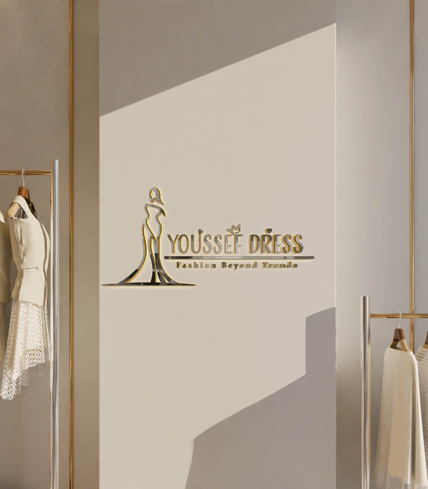
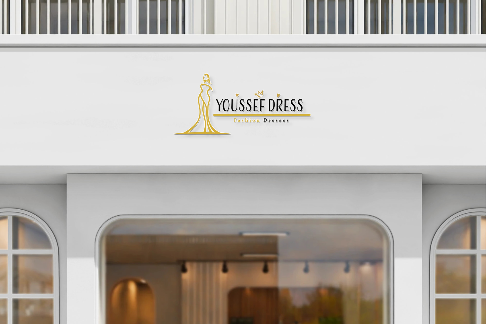
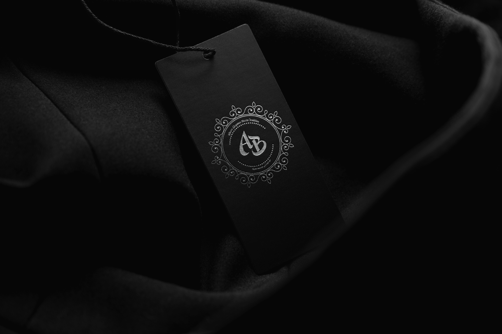
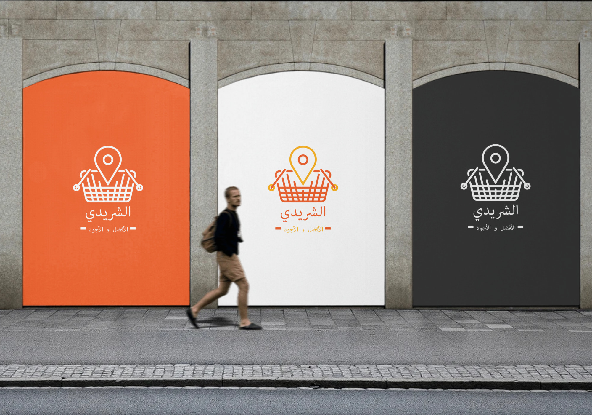

# Logo Design Portfolio – Selected Works

This collection showcases a diverse range of logo and brand identity projects across fashion, construction, education, and e-commerce. Each identity was designed with a strong conceptual foundation, clear visual language, and practical real-world applications in mind.

---

## 1. Youssef Dress – Fashion Brand

**Alternate Version:**

### Description
A premium fashion brand identity combining a feminine silhouette with elegant typography to communicate sophistication, confidence, and timeless style. The golden color palette reinforces a luxury positioning suitable for boutiques and designer labels.

### Design Idea
Translate femininity and elegance into a simple, memorable mark using a flowing dress silhouette balanced with clean, modern typography.

### Story Behind It
The logo represents a brand that focuses on elegance beyond trends, symbolizing grace, confidence, and premium craftsmanship.

### Key Elements
- **Colors:** Gold, Black, White
- **Typography:** Elegant serif + clean sans-serif
- **Style:** Elegant, Luxury, Minimal
- **Industry:** Fashion / Dresses

---

## 2. Arkan – Finishing & Decoration

### Description
A strong architectural logo for a finishing and decoration company, using a roof-inspired symbol and bold typography to express stability, reliability, and craftsmanship.

### Design Idea
Build a clear visual connection to architecture and construction through a solid, geometric roof form paired with confident typography.

### Story Behind It
The logo reflects Arkan's commitment to quality, durability, and trust—key values in the construction and interior finishing industry.

### Key Elements
- **Colors:** Gray, Metallic tones
- **Typography:** Bold serif / semi-serif
- **Style:** Professional, Industrial, Solid
- **Industry:** Construction / Finishing / Decoration

---

## 3. AB Monogram – Luxury Fashion Label

*(Image to be added)*

### Description
A refined monogram identity designed for a high-end fashion brand, featuring ornamental circular detailing and elegant initials for a timeless, premium feel.

### Design Idea
Create a classic monogram that works perfectly on tags, packaging, and fabric labels while maintaining a strong luxury character.

### Story Behind It
The logo blends heritage and modern elegance, representing craftsmanship, attention to detail, and exclusivity.

### Key Elements
- **Colors:** Black, White, Gold / Silver
- **Typography:** Custom monogram lettering
- **Style:** Classic, Elegant, Premium
- **Industry:** Fashion / Accessories

---

## 4. Souqoom – E-Commerce / Marketplace

**Alternate Version:**

### Description
A modern e-commerce logo combining a shopping bag and a globe to represent global access, connectivity, and smart online shopping.

### Design Idea
Merge the concepts of shopping and worldwide reach into a single, simple, and scalable icon.

### Story Behind It
The logo reflects a marketplace without borders, connecting buyers and sellers through a clear and recognizable symbol.

### Key Elements
- **Colors:** Orange, Black, White, Red (stamp use)
- **Typography:** Clean modern sans-serif (Arabic & English)
- **Style:** Modern, Minimal, Corporate
- **Industry:** E-commerce / Online Marketplace

---

## 5. Abajte – Luxury Brand

**Alternate Versions:**

### Description
A typography-driven luxury logo designed to express elegance, exclusivity, and premium quality through refined letterforms and metallic finishes.

### Design Idea
Focus on a clean, powerful wordmark that feels sophisticated without unnecessary complexity.

### Story Behind It
The logo represents a brand built on taste, detail, and craftsmanship, suitable for fashion, accessories, and boutique branding.

### Key Elements
- **Colors:** Black, Gold, Silver
- **Typography:** Custom elegant display serif
- **Style:** Luxury, Elegant, Premium
- **Industry:** Fashion / Luxury Goods

---

## 6. English Station – Education / Language Learning

### Description
A friendly and inspiring educational logo featuring a character reaching toward knowledge symbols, representing growth, ambition, and learning.

### Design Idea
Combine education and motivation into a playful, modern visual language that appeals to students and learners.

### Story Behind It
The logo tells the story of learners aiming higher and improving their English skills step by step in a supportive environment.

### Key Elements
- **Colors:** Blue, Yellow, White
- **Typography:** Rounded, friendly sans-serif
- **Style:** Modern, Educational, Playful
- **Industry:** Education / Language Training

---

## 7. الشريدي (Al-Shuraidi) – Retail / E-Commerce

### Description
A modern retail identity combining a shopping basket with a location pin to communicate easy access, convenience, and smart shopping.

### Design Idea
Visually merge shopping and location concepts into a simple, highly recognizable symbol.

### Story Behind It
The logo reflects a brand focused on making shopping easier, faster, and more accessible for customers.

### Key Elements
- **Colors:** Orange, White, Black
- **Typography:** Clean modern Arabic type
- **Style:** Modern, Commercial, Friendly
- **Industry:** Retail / E-commerce

---

## Portfolio Summary

| # | Project | Style | Industry | Status |
|---|---------|-------|----------|--------|
| 1 | Youssef Dress | Elegant, Luxury, Minimal | Fashion / Dresses | Complete |
| 2 | Arkan | Professional, Industrial, Solid | Construction / Finishing | Complete |
| 3 | AB Monogram | Classic, Elegant, Premium | Fashion / Accessories | Pending Image |
| 4 | Souqoom | Modern, Minimal, Corporate | E-commerce / Marketplace | Complete |
| 5 | Abajte | Luxury, Elegant, Premium | Fashion / Luxury Goods | Complete |
| 6 | English Station | Modern, Educational, Playful | Education / Language Training | Complete |
| 7 | الشريدي | Modern, Commercial, Friendly | Retail / E-commerce | Complete |

---

## Design Philosophy

These projects demonstrate a versatile approach to logo design, balancing concept, aesthetics, and real-world usability. Each identity was crafted to be:

- **Scalable** – Works from favicon to billboard
- **Recognizable** – Memorable at a glance
- **Aligned** – Reflects the brand's core values and industry positioning

---

*Last updated: February 2026*
